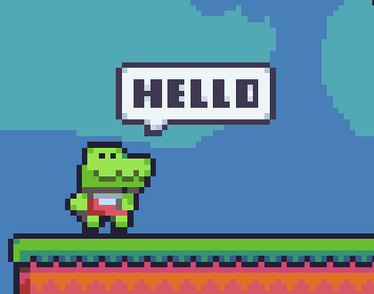
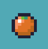
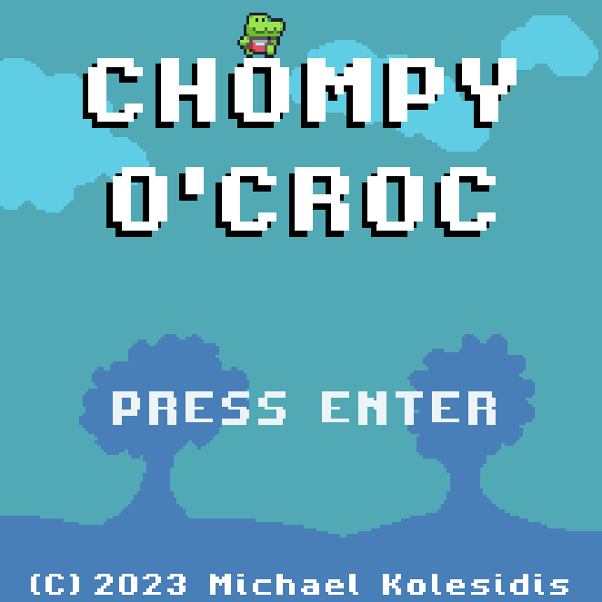
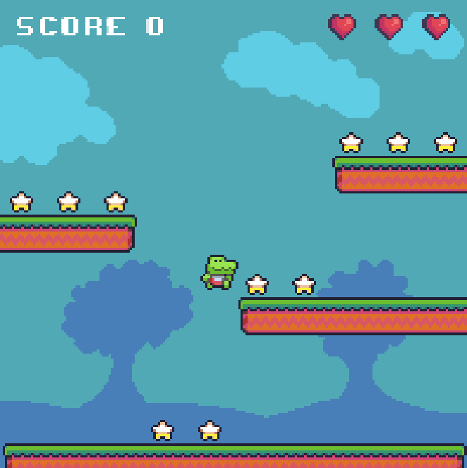

# Chompy O'Croc

**Run and jump around platforms, collecting stars, chomping on delicious food, and avoiding bombs!**

_Chompy O'Croc_ is a 2D arcade/platform game created in the style of pixel art.

## Technologies

The game was made with [Phaser](https://phaser.io/), [Vite](https://vitejs.dev/), and [TypeScript](https://www.typescriptlang.org/).

## Gameplay

You are _Chompy_, a cute crocodile with a big appetite for food and adventure! You have three ❤️ at the start of the game. You are inside a colorful level, that consists of the ground and three platforms.

### Stars

At the start of the game, **10 stars** to collect fall from the sky and are spread throughout the level. When all stars are collected, a new batch falls, along with a bomb.

### Bombs

Bombs **bounce around the level** at a random speed. Whenever the player is touched a bomb, one of the three ❤️ is lost.

### Food

After **Round 3**, and **every second round**, a piece of food enters the game along with the bomb, that serves as power-up. There are currently two power-ups:

#### Banana

**Restores health** to three ❤️.

#### Orange

**Removes all bombs** from the level.

## Controls

The game is played exclusively with the keyboard.

|      Key(s)      | Action             |
| :--------------: | ------------------ |
|    Left Arrow    | Move Left          |
|   Right Arrow    | Move Right         |
| Up Arrow / Space | Jump               |
|      Enter       | Game start/restart |

## Screenshots

## Trivia

- _Chompy_ loves pizza!
- I created all the pixel art used in the game using [LibreSprite](https://libresprite.github.io/#!/).
- The character, the platforms and the stars were adapted from an image featured in the homepage of [Aseprite](https://www.aseprite.org/), with me adding the character's animation frames.
- The game is based on a tutorial found in the official [Phaser website](https://phaser.io/tutorials/making-your-first-phaser-3-game).

## Copyright

© 2023 Michael Kolesidis
