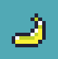
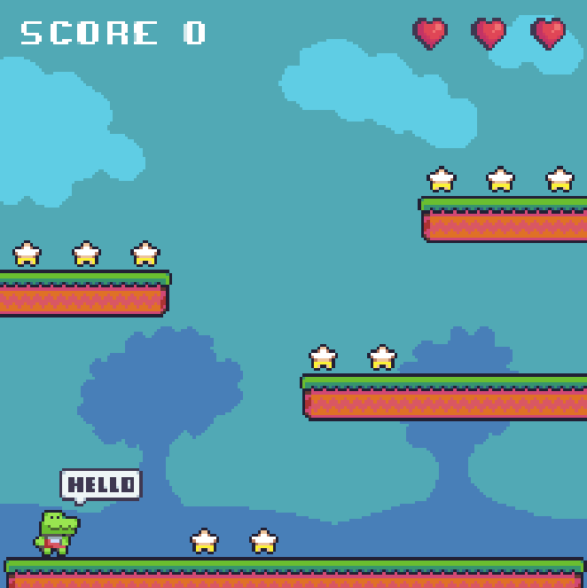

# Chompy O'Croc

Run and jump around platforms, collecting stars, chomping on delicious food, and avoiding bombs!

## Technologies

The game was made with [Phaser](https://phaser.io/), [Vite](https://vitejs.dev/), and [TypeScript](https://www.typescriptlang.org/).

## Gameplay

You are Chompy, a cute crocodile with a big appetite for food and adventure! You have three ❤️ at the start of the game. You are inside a colorful level, that consists of the ground and three platforms.

### Stars

At the start of the game, 10 stars to collect fall from the sky and are spread throughout the level. When all stars are collected, a new batch falls, along with a bomb.

### Bombs

Bombs bounce around the level at a random speed. Whenever the player touched a bomb, one of the three ❤️ is lost.

### Food

After round 3, and every second round, a piece of food enters the game along with the bomb, that serves as power-up. There are currently two power-ups:

#### Banana

Restores health to 3 hearts

#### Orange

Removes all bombs from the level

## Screenshots

## Trivia

Chompy loves pizza!

## Copyright

(C) 2023 Michael Kolesidis
